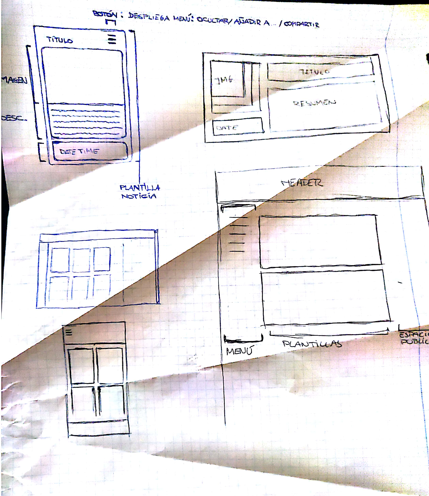
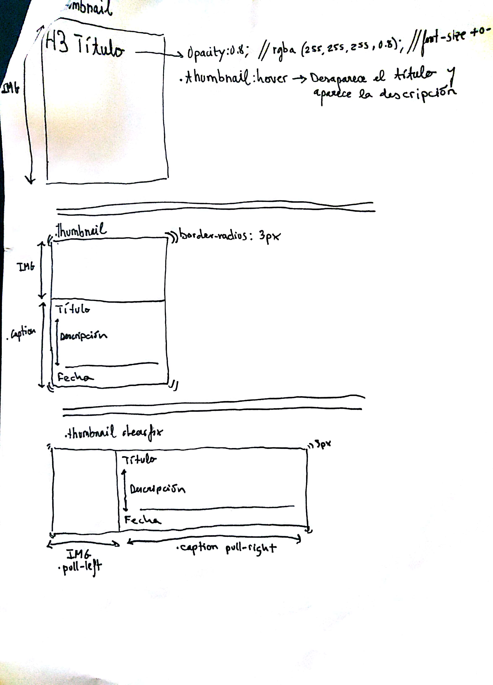

# NOTICIA
**Enlace:** https://rawgit.com/alexgaya/noticias/master/index2.html  
**Enlace rss:** https://rawgit.com/alexgaya/noticias/master/rss/rss.xml  
**Autor:** Alejandro Gayá  
**Descripción:** Proyecto de página web con html, css, jss y rss o json. A través de esta web se accede a una página web de noticias en la cual se van cargando más noticias a medida que haces scroll.  

## Diseño:
  
  

A medida que ha ido avanzando el proyecto se han hecho pequeñas modificaciones en cuanto a la idea principal de la estructura pero siempre respetando el concepto base.  

## Progreso:
+ ##### Adaptación del diseño principal a la entorno web.  
+ ##### Modificación de estructura.  
+ ##### Creación de 4 noticias. 
+ ##### Añadidos vídeos youtube.  
+ ##### Publicidad añadida en escritorio y smartphone.  
+ ##### Ficheros Json creados para añadir noticias con el evento scroll.  
+ ##### Imágenes comprimidas.  
+ ##### Añadido botón para desactivar evento scroll y cargar las noticias medianto botón "cargar más noticias".  
+ ##### Creación de rss.xml y validado en https://validator.w3.org/feed/.  
+ ##### Añadidas las etiquetas open graph en el index y las 4 noticias.
